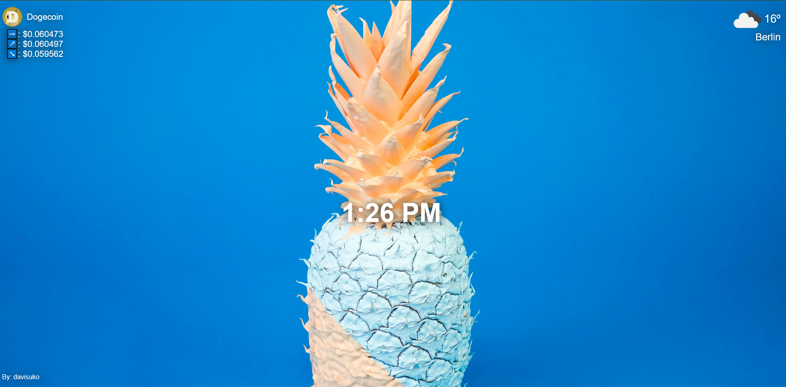

# Chrome Dashboard Interface

## Description

This Chrome extension provides real-time weather updates, cryptocurrency information, and dynamic background images. It fetches data from various APIs to keep you informed and entertained while browsing the web.

## Features

- **Weather Updates**: Get the latest weather information for your location.
- **Cryptocurrency Data**: Stay up-to-date with cryptocurrency prices and trends.
- **Dynamic Backgrounds**: Enjoy a fresh and captivating background image each time you open a new tab.

## Installation

1. Clone the repository to your local machine.
2. Open Chrome and navigate to `chrome://extensions/`.
3. Enable "Developer mode" in the upper-right corner.
4. Click on "Load unpacked" and select the extension directory.

## Usage

1. Open a new tab in Chrome.
2. Enjoy the real-time weather, cryptocurrency data, and dynamic background images.

## Screenshots

## Technologies Used

- HTML
- CSS
- JavaScript
- [Weather API](https://openweathermap.org/api)
- [Cryptocurrency API](https://www.coingecko.com/en/api)
- [Background Image API](https://unsplash.com/documentation) 

## Contributing

Contributions are welcome! If you'd like to improve this extension or report issues, please [submit an issue](https://github.com/nharjes/your-repo/issues) or [create a pull request](https://github.com/nharjes/your-repo/pulls).

## License

This project is licensed under the MIT License - see the [LICENSE](LICENSE) file for details.

## Acknowledgments

- Thanks to the creators of the APIs used in this extension.

